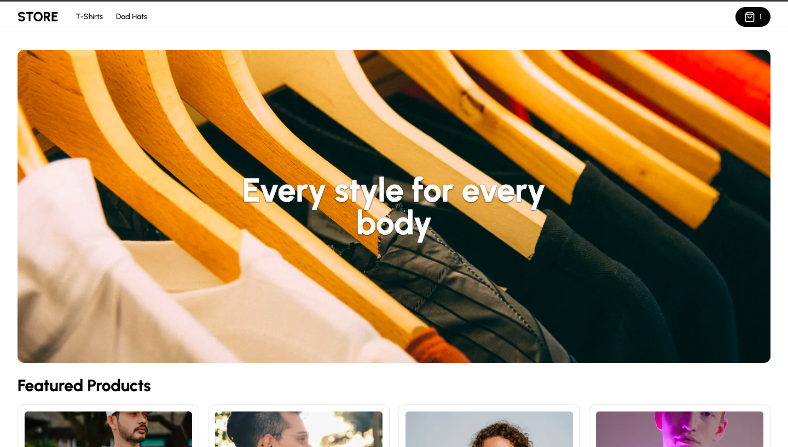

<div align="center">
  <section>
    <h1>
      <a href="https://ecommerce-store-steez.vercel.app/" target="_blank" >
        Visit my e-commerce store
      </a>
    </h1>
    
    <h2>
      A dynamic and engaging online shopping experience created powered by
      <br />
      <a href="https://github.com/steezplusplus/ecommerce-admin">E-commerce Admin</a>.
    </h2>
  </section>
  <section>
    <a href="https://github.com/steezplusplus/ecommerce-store/stargazers" target="_blank" >
      
    </a>
    <a href="https://github.com/steezplusplus/ecommerce-store/issues" target="_blank" >
      
    </a>
    <a href="/LICENSE" target="_blank" >
      
    </a>
    <a href="#">
      
    </a>
    <a href="#">
      
    </a>
  </section>
  <section>
    <h2>Built with</h2>
    <p>typescript - postcss - eslint - prettier - tailwind - vercel - nextjs13 - cloudinary - clerk - prisma - supabase</p>
  </section>
  <br />
  <section>
    <h2>Support me!</h2>
    <p>
      If you liked my e-commerce store
      <br />
      <em>Leave a ⭐</em>
    </p>
    <p>
      Have a question?
      <br />
      <em>
        <a href="https://twitter.com/CodingSteez" target="_blank">Send me a tweet</a>
      </em>
    </p>
    <p>
      Want to use my code?
      <br />
      <em>
        Go ahead! If you make anything cool, I'd love to see it.
      </em>
    </p>
    <p>
      Find an issue?
      <br />
      <em>
        <a href="https://github.com/steezplusplus/ecommerce-store/issues" target="_blank">Please open an issue</a>
      </em>
    </p>
  </section>
  <br />
</div>

## Features

- Search through a stores categories and products
- Filter items by their attributes
- Add items to your cart

## Setup

1. If not already done, set up [E-commerce Admin](https://github.com/steezplusplus/ecommerce-admin).

2. Clone this project

3. Install Dependencies

```shell
npm i
```

4. Get `NEXT_PUBLIC_API_URL` from [E-commerce Admin](https://github.com/steezplusplus/). Place it in `.env`

```shell
NEXT_PUBLIC_API_URL=
```

5. If not already running, start the Admin: [E-commerce Admin](https://github.com/steezplusplus/)

```shell
npm run dev
```

6. Start the frontend (this project)

```shell
npm run dev
```

## Available commands

| command | description                              |
| :------ | :--------------------------------------- |
| `dev`   | Starts a development instance of the app |

## Entity Relationship Diagram


